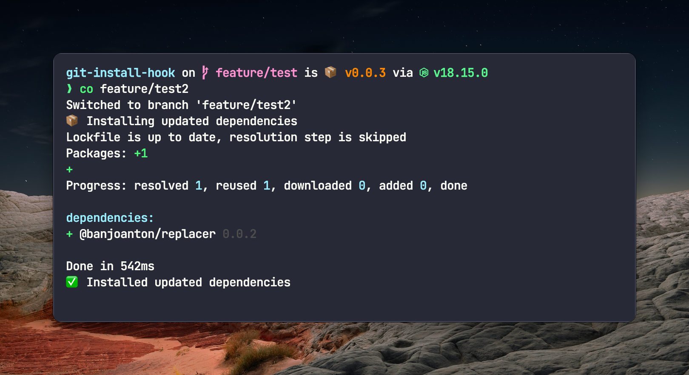

# git-install-hook

Install dependencies automatically when you change branches or merge and some new dependencies have been added or removed.

Made to be used with the `post-checkout` and `post-merge` hooks.

It detects the package manager automatically and installs the dependencies. You can prompt the user if you want to install the dependencies on change.



## Supported package managers

-   [npm](https://www.npmjs.com/)
-   [yarn](https://yarnpkg.com/)
-   [pnpm](https://pnpm.io/)

## Install

```bash
# npm
npm install --save-dev git-install-hook

# yarn
yarn add -D git-install-hook

# pnpm
pnpm add -D git-install-hook
```

## Usage

The command is supposed to run with `simple-git-hooks` or `husky`.

### Basic usage in terminal

```bash
# run normally
git-install-hook

# Ask if you want to install the dependencies on change
git-install-hook --prompt
```

### simple-git-hooks

Install `simple-git-hooks` and initialize it. After that you can add the hooks to your `package.json`. Below example is for `pnpm`. For `npm` and `yarn` you can use `npx` or `yarn dlx` instead of `pnpm exec`.

```json
"simple-git-hooks": {
    "post-checkout": "pnpm exec git-install-hook",
    "post-merge": "pnpm exec git-install-hook --prompt"
}
```

Run the `simple-git-hooks` command to install the hooks:

```bash
# npm
npx simple-git-hooks

# yarn
yarn dlx simple-git-hooks

# pnpm
pnpm exec simple-git-hooks
```

### husky

Run the prepare script to install the hooks:

```bash
# npm
npx husky install

# yarn
yarn dlx husky install

# pnpm
pnpm dlx husky install
```

Add the `post-checkout` or the `post-merge` hook:

```bash
# npm
npx husky add .husky/post-checkout "npx git-install-hook"

# yarn
yarn dlx husky add .husky/post-checkout "yarn dlx git-install-hook"

# pnpm
pnpm dlx husky add .husky/post-checkout "pnpm exec git-install-hook"
```

## Flags

-   `--prompt` - Ask if you want to install the dependencies on change.
-   `--debug` - Show debug messages.
-   `--installation` - Installation output. Can be `show`, `hide` or `spinner`. Default is `show`.
-   `--no-text` - Don't show information text output.
